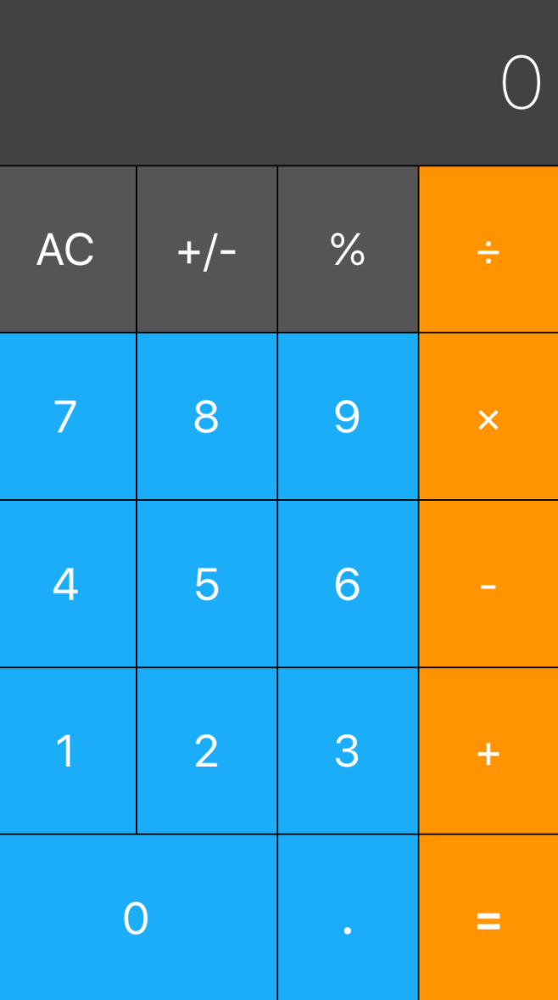
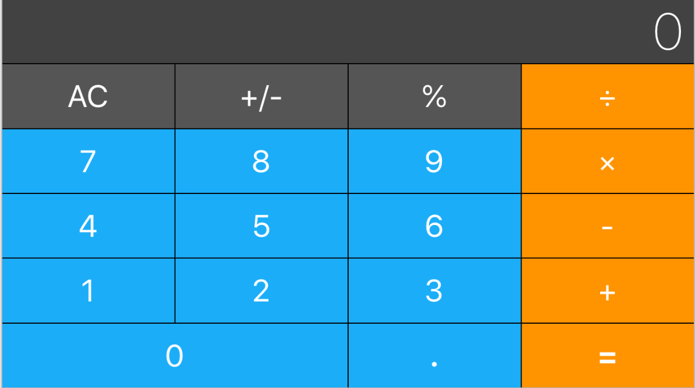

# Calculator Layout Challenge

No knowledge is your own until you put it into practice. Using what you've learnt about auto layout and setting constraints, create the following UI.

## Portrait

## Landscape

>This is a companion project to The App Brewery's Complete App Developement Bootcamp, check out the full course at [www.appbrewery.co](https://www.appbrewery.co/)

